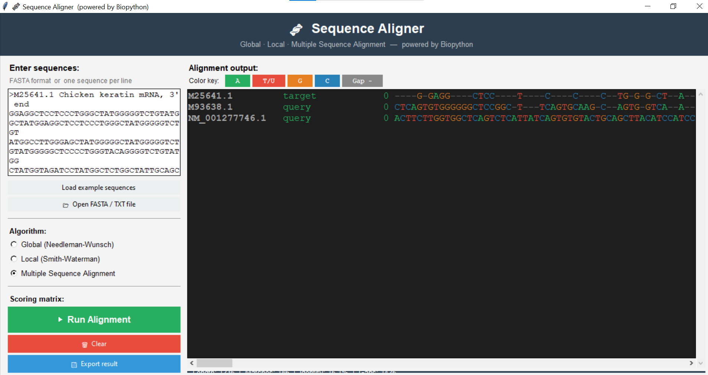

# 🧬 Sequence Aligner

A desktop sequence alignment tool built with Python, Biopython, and Tkinter. Supports pairwise and multiple sequence alignment with a simple GUI.

Sequence alignment is the process of arranging two or more DNA or protein sequences to identify regions of similarity, which can reveal evolutionary relationships or shared biological functions between organisms. This tool automates that process by using well known algorithms like Needleman-Wunsch and Smith-Waterman, which work by scoring matches, mismatches, and gaps to find the most optimal way to line up the sequences. 

---

## Features

- **Global Alignment** — Needleman-Wunsch algorithm, aligns two sequences end to end
- **Local Alignment** — Smith-Waterman algorithm, finds the best matching region between two sequences
- **Multiple Sequence Alignment** — progressive alignment based on the ClustalW approach, works with 3 or more sequences
- **Scoring matrix options** — Simple match/mismatch, BLOSUM62, or PAM250
- **FASTA file support** — load sequences from a .fasta or .txt file, or just paste them directly
- **Color coded output** — each base (A, T, G, C) is displayed in a different color
- **Alignment stats** — shows length, matches, identity percentage, and gap count
- **Export results** — save the alignment output to a text file

---

## Screenshots



---

## Requirements

- Python 3.8 or higher
- Biopython

Tkinter comes included with Python so no separate install is needed for that.

---

## Setup

**1. Clone the repository**
```
git clone https://github.com/ToobaMir/sequence-aligner.git
cd sequence-aligner
```

**2. Install Biopython**
```
pip install biopython
```

**3. Run the program**
```
python aligner.py
```

---

## How to use

1. Paste your sequences into the text box on the left, either in FASTA format or one sequence per line
2. Or click **Open FASTA / TXT file** to load a file from your computer
3. Select an algorithm using the radio buttons (Global, Local, or MSA)
4. Choose a scoring matrix from the dropdown
5. Set a gap penalty (default is -2)
6. Click **▶ Run Alignment**
7. The aligned sequences appear on the right panel with color coded bases
8. Click **Export result** to save the output to a file

### Input format examples

FASTA format:
```
>Human
ATGCGTACGTTAGCTAGCTTACG
>Mouse
ATGCGTACGTTGGCTAACTTACG
```

Plain text (one sequence per line):
```
ATGCGTACGTTAGCTAGCTTACG
ATGCGTACGTTGGCTAACTTACG
```

---

## Project structure

```
sequence-aligner/
│
├── aligner.py       # main file, contains all code
└── README.md
```

---

## Built with

- [Python](https://www.python.org/)
- [Biopython](https://biopython.org/)
- [Tkinter](https://docs.python.org/3/library/tkinter.html)

